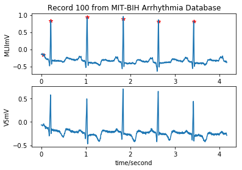

# DWT

The DWT block performs a discrete wavelet transform. This method captures both spatial and temporal information about the signal, offering a distinct advantage over the conventional FFT. Popular wavelets include the Haar and Daubechies wavelets; however, our DWT generator is generalizable to any wavelet.

The DWT transform consists of a set of filter banks and downsampling blocks. First, the signal is simultaneously passed through a highpass and lowpass filter, resulting in a set of "detail" and "approximate" coefficients. Next, the two resulting signals are passed through downsampling blocks to remove redundant information. This decomposition process can be performed multiple times to improve the frequency resolution and accuracy of the the approximation:


Calculation of the tap coefficients for the lowpass and highpass filters will be computed offline (through some software such as MATLAB, Python), while the filtering and downsampling will occur online. You can refer to [`wavelet_transform.ipynb`](../scripts/wavelets/wavelet_transform.ipynb) file for a brief overview of the implementation of the DWT transform by a Python golden model.

## Parameters

The DWT generator has the following configurable parameters, found in [`DWTParams`](../src/main/scala/dwt/DWTParams.scala):
```
trait DWTParams[T <: Data] {
  val protoData: T
  val taps_LPF: Seq[T]
  val taps_HPF: Seq[T]
}
```

* `taps_LPF` corresponds to the tap coefficients for the lowpass filter. 
    
* `taps_HPF` corresponds to the tap coefficients for the highpass filter. 

## Input and Output Ports

The DWT generator has one input and two outputs. The input port is a stream of data, while the two output ports represent the computed coefficients of each level of the DWT transform.

```
class DWTIO[T <: Data](val params: DWTParams[T], val num_levels: Int) extends Bundle {
  val in = Flipped(ValidWithSync(params.protoData.cloneType))
  val approx_coeffs = Vec(num_levels, ValidWithSync(params.protoData.cloneType)) 
  val detail_coeffs = Vec(num_levels, ValidWithSync(params.protoData.cloneType))
}
```

## ECG Feature Extraction - QRS Detection
The DWT transform lies at the heart of QRS detection. The QRS complex provides quantitative analysis of cardiac states such as tachycardia (abnormally high heart rate), bradycardia (abnormally low heart rate), and others. While we did not implement the full QRS detection algorithm in hardware, our python golden model [`wavelet_transform.ipynb`](../scripts/wavelets/wavelet_transform.ipynb) showcases the utility of this transform on the MIT-BGH Arrhythmia dataset (https://www.physionet.org/physiobank/database/mitdb/). An example plot is shown below:


